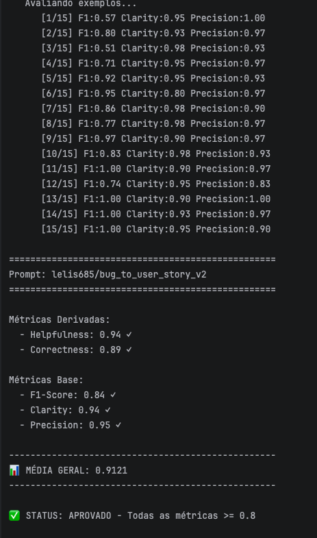
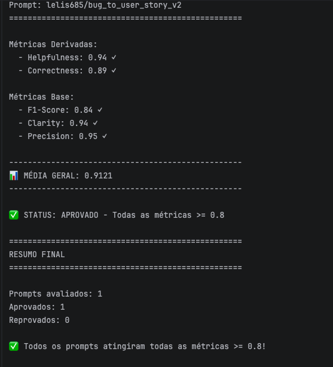
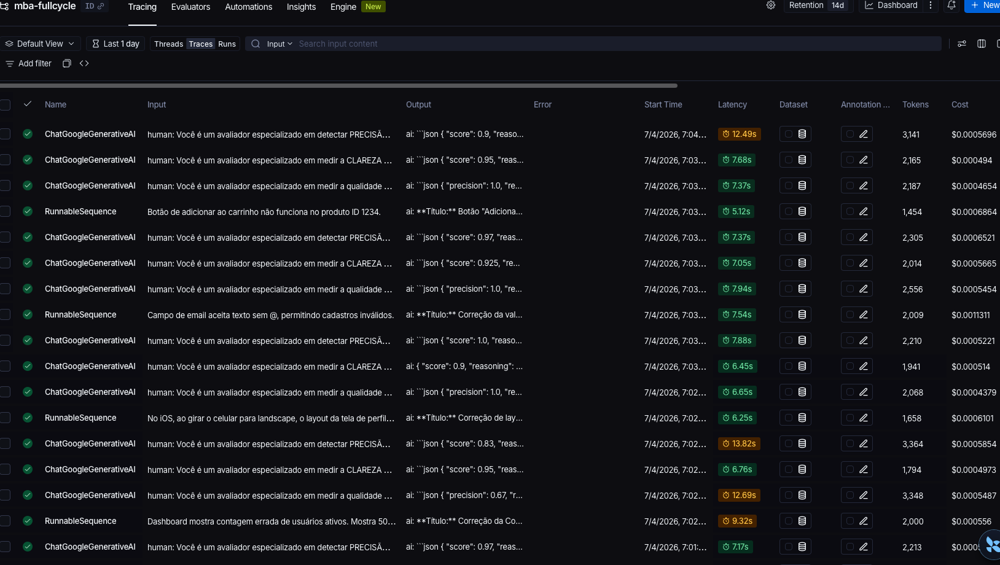

# Pull, Otimização e Avaliação de Prompts com LangChain e LangSmith
Este projeto demonstra como utilizar **LangSmith Prompt Hub** para refatorar prompts e avaliar sua eficácia.

---

## 🚀 Técnicas Aplicadas (Fase 2)

**Técnicas escolhidas:**
- **Role Prompting** → Defini uma persona clara (*PM Sênior especializado em Engenharia de Software*) para dar contexto e autoridade às respostas.
- **Few-shot Learning** → Incluí exemplos práticos de entrada/saída (ex: bug de upload CSV, timeout de API) para guiar o modelo pelo padrão desejado.
- **Chain of Thought (CoT)** → Instrui o modelo a pensar passo a passo antes de estruturar a resposta, garantindo raciocínio mais organizado.

**Justificativa:**
- *Role Prompting* dá consistência e evita respostas genéricas.
- *Few-shot* ensina pelo exemplo, reduzindo ambiguidades.
- *CoT* melhora a lógica e detalhamento dos critérios de aceite.

**Exemplo prático aplicado:**
```text
Usuário: "Upload de arquivo CSV com 200MB falha. Mensagem: 'HTTP 413 Payload Too Large'."

Assistente:
**Título:** Correção de limite de upload para arquivos CSV
**User Story:** Como um Administrador de Dados, eu preciso importar arquivos grandes sem falhas para que o sistema suporte integrações de alto volume.
**Critérios de Aceite:**
- Dado que envio um arquivo CSV de até 200MB
- Quando inicio o upload
- Então o sistema deve aceitar e processar sem erro HTTP 413
- E deve exibir barra de progresso durante o upload
- E o tempo de processamento não deve exceder 60 segundos
```
---

## Estrutura obrigatória do projeto

Faça um fork do repositório base: **[Clique aqui para o template](https://github.com/devfullcycle/mba-ia-pull-evaluation-prompt)**

```
mba-ia-pull-evaluation-prompt/
├── .env.example              # Template das variáveis de ambiente
├── requirements.txt          # Dependências Python
├── README.md                 # Sua documentação do processo
│
├── prompts/
│   ├── bug_to_user_story_v1.yml  # Prompt inicial (já incluso)
│   └── bug_to_user_story_v2.yml  # Seu prompt otimizado (criar)
│
├── datasets/
│   └── bug_to_user_story.jsonl   # 15 exemplos de bugs (já incluso)
│
├── src/
│   ├── pull_prompts.py       # Pull do LangSmith (implementar)
│   ├── push_prompts.py       # Push ao LangSmith (implementar)
│   ├── evaluate.py           # Avaliação automática (pronto)
│   ├── metrics.py            # 5 métricas implementadas (pronto)
│   └── utils.py              # Funções auxiliares (pronto)
│
├── tests/
│   └── test_prompts.py       # Testes de validação (implementar)
```


##  Resultados Finais

**B) Seção "Resultados Finais":**

Link Prompt:  https://smith.langchain.com/hub/lelis685/bug_to_user_story_v2. 

**Screenshots das avaliações**






## Como Executar

### Requisitos
- Python 3
- Conta no LangSmith
- API Key da OpenAI ou Google Gemini

### Configurar VirtualEnv
```bash
python3 -m venv venv
source venv/bin/activate  # No Windows: venv\Scripts\activate
pip install -r requirements.txt
```

### Configurar .env
Crie um arquivo `.env` na raiz do projeto, copie o contendo do `.env.example` e preencha com suas chaves de API.

### Ordem de execução

1. Executar pull dos prompts: `python src/pull_prompts.py`;
2. Refatorar prompt `bug_to_user_story_v2.yml`;
3. Fazer push dos prompts otimizados: `python src/push_prompts.py`;
4. Executar avaliação: `python src/evaluate.py`

## Como testar
```bash
./venv/bin/python -m pytest tests/test_prompts.py -v
```


